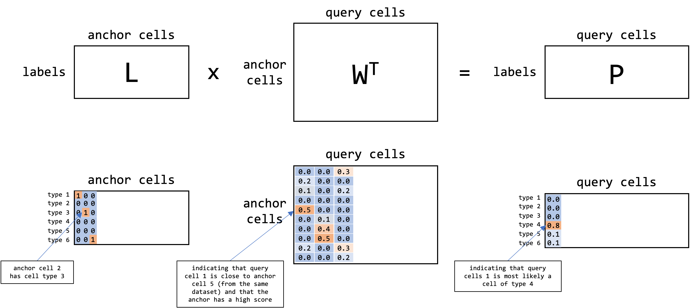

```{r}
suppressPackageStartupMessages({
   library(tidyverse)
   library(ComplexHeatmap)
   library(grid)
   library(gridExtra)
   library(CCA)
   library(GGally)
   library(ArchR)
   library(parallel)
})
Sys.setenv(RETICULATE_PYTHON =
             "/home/philipp/miniconda3/envs/r-reticulate/bin/python")
```

# Status

Work in progress.

# Overview

1. CCA Objective

2. Classic Example

3. Solution via SVD

4. Implementation

5. Application to single cell data

5a) Integration of two scRNA-seq datasets

5b) Integration of scRNA-seq and scATAC-seq datasets

* In particular we want to transfer RNA-seq counts and the celltype labels from the scRNA-seq dataset to the scATAC-seq datasets

# Resources

* Lecture: Data Mining, Spring 2013, by Ryan Tibshirani, lectures 10 - 13 (see here: https://www.stat.cmu.edu/~ryantibs/datamining/)

* PhD Thesis: Practical Algorithms for Latent Variable Models by 
Gregory W. Gundersen (http://gregorygundersen.com/publications/gundersen2021thesis.pdf)

* Applied CCA in R: https://stats.oarc.ucla.edu/r/dae/canonical-correlation-analysis/

* Paper: A penalized matrix decomposition, with applications to sparse principal components and canonical correlation analysis [@10.1093/biostatistics/kxp008]

* Paper: Comprehensive Integration of Single-Cell Data (Seurat V3) [@10.1038/nbt.4096; @10.1016/j.cell.2019.05.031]

# CCA Objective

Given two datasets $X$ and $Y$, 

* $X \in \mathbb{R}^{N \times M}$ with $N$ observation and $M$ features.

* $Y \in \mathbb{R}^{N \times P}$ with $N$ observations and $P$ features.

Our goal is to find linear combinations of the columns of $X$ and $Y$, such that the resulting vectors of length $N$ are maximally correlated. In other words, we seek to find the canonical correlation vectors $\hat{h_X}$ and $\hat{h_Y}$ such that $X \hat{h_X}$ and $Y \hat{h_Y}$ are maximally correlated.

$$
\hat{h_X}, \hat{h_Y} = \arg\max_{h_X, h_Y} corr(X h_X, Y h_Y)
$$

Why are we even interested in that? An example would be to compare the loadings in a pair of canonical vectors  $\hat{h_X}$, $\hat{h_Y}$ : Features from $X$ that have a high absolute loading in  $\hat{h_X}$, and features from $Y$ that have a high absolute loading in $\hat{h_Y}$ show some pattern of co-variation because they might be based on the same latent factors (e.g. personality traits).

# Classic Example

To get an intuition for CCA, we will look at a rather classical example.

## Data & Questions

We will download the questions that were used for the development of the Multidimensional Introversion-Extraversion Scales (see here: https://openpsychometrics.org/_rawdata).

The test contains 91 questions about the personality of the participants. We remove Q44 which is apparently doubled.

```{r}
if (!any(str_detect(list.dirs("/mnt/sda/data", recursive = FALSE), 
           "MIES_Dev_Data$"))) {
  downloader::download(
  url="https://openpsychometrics.org/_rawdata/MIES_Dev_Data.zip",
  dest="/mnt/sda/data/MIES_DATA.zip", 
  mode="wb")
  unzip("/mnt/sda/data/MIES_DATA.zip", exdir = "/mnt/sda/data/")
  unlink("/mnt/sda/data/MIES_DATA.zip")
}
mies_data <- read_tsv("/mnt/sda/data/MIES_Dev_Data/data.csv", 
                      show_col_types = FALSE) %>%
   dplyr::select(tidyselect::matches("Q[0-9]{1,2}A"))
dim(mies_data)
```

```{r}
q_raw <- read_lines("/mnt/sda/data/MIES_Dev_Data/codebook.txt") %>%
   `[`(., 10:100)
questions <- tibble::tibble(
   q = paste0(str_extract(q_raw, "Q[0-9]{1,2}"), "A"),
   text = str_extract(q_raw, '(?<=: ").+\\.')
)

#questions %>%
#   filter(q %in% c("Q5A", "Q44A"))

questions <- questions %>% dplyr::filter(q != "Q44A")
q_cleaned <- mies_data[,1:91 != 44]

questions
```

For the sake of this tutorial we will randomly split the test into test A with the first 40 questions and test B with the last 50 questions.

```{r}
test_A <- q_cleaned[,1:40]
test_B <- q_cleaned[,41:90]
```

So after all we have the following datasets $X$ and $Y$:

* $X \in \mathbb{R}^{N \times M}$ with persons/observation $g = 1,...N$ (here: $N=7188$) and questions $Q^A_c$ with $c=1,...,M$

* $Y \in \mathbb{R}^{N \times P}$ with persons/observation $g = 1,...N$ (here: $N=7188$) and questions $Q^B_d$ with $d=1,...,P$

And translating the CCA objective for this tasks, our goal is to find linear combinations of the columns of the questions scores from test A and the question scores from test B, such that the resulting vectors of length $N$ are maximally correlated.

In mathematical terms we seek to find the canonical correlation vectors $\hat{h_X}$ and $\hat{h_Y}$ such that $X \hat{h_X}$ and $Y \hat{h_Y}$ are maximally correlated.

$$
\hat{h_X}, \hat{h_Y} = \arg\max_{h_X, h_Y} corr(X h_X, Y h_Y)
$$

Thus, questions that get a high loading in $\hat{h_X}$ and questions that get a high loading in $\hat{h_Y}$ will be similar, meaning they query similar personality traits.

We can find $min(M,P)$ pairs of canonical correlation vectors as desribed below in the math section.

## Results

We will use the `CCA` package to perform the CCA analysis here.

```{r}
cca_out <- stats::cancor(test_A, test_B)
```

Looking at the distribution of the correlation coefficients.

```{r fig.width=6, fig.height=4}
ggplot() +
   geom_point(aes(x=1:length(cca_out$cor), y=cca_out$cor)) +
   labs(y = "Correlation Coefficient", x = "Index")
```

### 1. CC Vector

Checking which questions from A and which questions from B got a high loading in the first canonical correlation vector.

```{r}
qa <- questions %>% 
   left_join(tibble(q=names(cca_out$xcoef[,1]), xcoef1=cca_out$xcoef[,1],
                    xcoef2=cca_out$xcoef[,2], xcoef3=cca_out$xcoef[,3]),
             by="q") %>%
   left_join(tibble(q=names(cca_out$ycoef[,1]), ycoef1=cca_out$ycoef[,1],
                    ycoef2=cca_out$ycoef[,2], ycoef3=cca_out$ycoef[,3]),
             by="q")
top_x <- 3
```

Top questions from test A:

```{r}
qa %>% slice_max(order_by=xcoef1, n=top_x) %>% pull(text)
```

Top questions from test B:

```{r}
qa %>% slice_max(order_by=ycoef1, n=top_x) %>% pull(text)
```

Also looking at the questions in B with the most negative loading.

```{r}
qa %>% slice_min(order_by=ycoef1, n=top_x) %>% pull(text)
```

We can also compare the results if we were to perform linear regression for "Q13A" ("I can keep a conversation going with anyone about anything") using the answers to all questions from test B as predictor.

```{r}
lm_res <- lm(cbind(test_A[,"Q13A"], test_B), formula = Q13A ~ .)
```

Again looking at the questions with the most positive coefficient.

```{r}
qa %>%
   dplyr::filter(q %in% (lm_res$coefficients %>% sort(decreasing=T) %>% `[`(., 1:top_x) %>% names)) %>%
   dplyr::pull(text)
```

And at the questions with the most negative coefficient.

```{r}
qa %>%
   dplyr::filter(q %in% (lm_res$coefficients %>% sort(decreasing=F) %>% `[`(., 1:top_x) %>% names)) %>%
   dplyr::pull(text)
```

### 2. CC Vector

```{r}
qa %>% slice_max(order_by=xcoef2, n=top_x) %>% pull(text)
qa %>% slice_max(order_by=ycoef2, n=top_x) %>% pull(text)
```

### 3. CC Vector

```{r}
qa %>% slice_max(order_by=xcoef3, n=top_x) %>% pull(text)
qa %>% slice_max(order_by=ycoef3, n=top_x) %>% pull(text)
```

# Solution via SVD

* Given $X \in \mathbb{R}^{N \times M}$ with observations $g = 1,...N$ and features $Q^A_c$ with $c=1,...,M$

* And $Y \in \mathbb{R}^{N \times P}$ with the same observations $g = 1,...N$ and different features $Q^B_d$ with $d=1,...,P$

* We seek to find $\hat{h_X}$ and $\hat{h_Y}$ (for now only first pair of canonical correlation vectors)

$$
\begin{align*}
\hat{h_X}, \hat{h_Y} &= \arg\max_{h_X, h_Y} corr(X h_X, Y h_Y) \\
 &= \arg\max_{h_X, h_Y} 
 \frac{Cov(X h_X, Y h_Y)}{\sqrt{V(X h_X)} \sqrt{V(Y h_Y)}}
\end{align*}
$$

* We call $z_X = X h_X$ and $z_Y = Y h_Y$ the first pair of canonical variables.

* We will columns of $X$ and $Y$ are centered (so the mean for each feature is 0)

$$
\mathbb{E}[X_{:,c}] = 0 \quad \forall c=1,...,M
$$

* Thus allows us to rewrite the correlation using inner products (or more specifically the dot product). Also not that this holds true because if $X, Y$ are centered, $z_X, z_Y$ will be centered.

$$
\begin{align*}
corr(x,y) &= \frac{Cov(x,y)}{\sqrt{V(x)} \sqrt{V(y)}} \\
&= \frac{\frac{1}{N} \sum_{i=1}^N(x_i-\bar{x})(y_i-\bar{y})^T}{\sqrt{\frac{1}{N} \sum_{i=1}^N(x_i-\bar{x})(x_i-\bar{x})^T} \sqrt{\frac{1}{N} \sum_{i=1}^N(y_i-\bar{y})(y_i-\bar{y})^T}} \\
&= \frac{\sum_{i=1}^Nx_i y_i^T}{\sqrt{ \sum_{i=1}^Nx_i x_i^T} \sqrt{ \sum_{i=1}^Nxy_i y_i^T}} \\
&= \frac{x^Ty}{\sqrt{x^Tx}\sqrt{y^Ty}} \\
&= \frac{\langle x,y \rangle}{\|x\|\|y\|}
\end{align*}
$$

* Thus we can rewrite the above equation:

$$
\begin{align*}
\hat{h_X}, \hat{h_Y} &= \arg\max_{h_X, h_Y} 
\frac{Cov(X h_X, Y h_Y)}{\sqrt{V(X h_X)} \sqrt{V(Y h_Y)}} \\
&= \arg\max_{h_X, h_Y} \frac{(Xh_x)^T(Yh_y)}{\sqrt{(Xh_x)^T(Xh_x)}\sqrt{(Yh_y)^T(Yh_y)}} \\
&= \arg\max_{h_X, h_Y} \frac{(Xh_x)^T(Yh_y)}{\|Xh_x\|_2\|Yh_y\|_2}
\end{align*}
$$

* Since the correlation is scale invariant, we constrain the solution using

$$
\begin{align*}
\hat{h_X}, \hat{h_Y}
&= \arg\max_{h_X, h_Y} (Xh_x)^T(Yh_y) \quad s.t. \; \|Xh_x\|_2=1, \; \|Yh_y\|_2 = 1
\end{align*}
$$

* The above equation holds true for the first pair of canonical vectors, but for the subsequent pairs, we require that the $k$'th canonical variables $Xh_x^{(k)}= z_x^{(k)} \in \mathbb{R}^N$, $Yh_y^{(k)}= z_y^{(k)} \in \mathbb{R}^N$ are orthogonal to all $(k-1)$ pairs. This ensures that the canonical variables capture different axes of covariation.

$$
\begin{align*}
\hat{h_X}^{(k)}, \hat{h_Y}^{(k)}
= \arg\max_{h_X, h_Y} (Xh_x)^T(Yh_y) \quad s.t. & \; \|Xh_x\|_2=1, \; \|Yh_y\|_2 = 1 \\
& (Xh_X^{(k)})^T(Xh_X^{(j)}) = 0 \; \forall \; j=1,...,k-1 \\
& (Yh_Y^{(k)})^T(Yh_Y^{(j)}) = 0 \; \forall \; j=1,...,k-1
\end{align*}
$$

* Given that $N \geq M$ and $N \geq P$, the total number of canonical directions (pairs of canonical vectors) is limited by the rank of $X$ of $Y$, we define the maximum number of directions as

$$
R = \min\{ rk(X), rk(Y) \}
$$

* To solve the objective we transform the problem by "sphering of the centered matrices $X \in \mathbb{R}^{N \times M}$ and $Y \in \mathbb{R}^{N \times P}$. Therefore, we first introduce the scatter matrices $S_X = X^TX$, $S_Y = Y^T Y$.

* Assuming that $rk(X) = M$ and $rk(Y) = P$, $S_X$, $S_Y$ are symmetric, positivie (semi)-definite, and thus we can factorize them into the non-negative square roots (similar to the cholesky decomposition):

$$
S_X = S_X^{1/2} S_X^{1/2}, \quad S_Y = S_Y^{1/2} S_Y^{1/2}
$$

* Now we can "sphere" our matrices $X$ and $Y$ via

$$
\tilde{X} = X S_X^{-1/2}, \tilde{Y} = Y S_Y^{-1/2}
$$

* This is called "sphering" because the covariance of $\tilde{X}$ and $\tilde{Y}$ are scaled identity matrices (assuming that $\tilde{X}$ is still centered):

$$
\begin{align*}
cov(\tilde{X}) &= cov(X S_X^{-1/2}) \\
&= \frac{1}{N}(X S_X^{-1/2})^T(X S_X^{-1/2}) \\
&= \frac{1}{N} (S_X^{-1/2})^T X^T X S_X^{-1/2} \\
&= \frac{1}{N} S_X^{-1/2} S_X S_X^{-1/2} \\
&= \frac{1}{N} I
\end{align*}
$$

* The objective (for the first pair of canonical vectors) becomes:

$$
\begin{align*}
\tilde{\hat{h_X}}, \tilde{\hat{h_Y}} &= \arg\max_{\tilde{h_X}, \tilde{h_Y}} 
(\tilde{X} \tilde{h_X})^T(\tilde{Y} \tilde{h_Y}) \quad s.t. & \; \|\tilde{X} \tilde{h_X}\|_2=1, \; \|\tilde{Y} \tilde{h_Y}\|_2 = 1
\end{align*}
$$

* where $h_X$ and $h_Y$ can be transformed back via

$$
h_X = S_X^{-1/2}\tilde{h_X}, \quad h_Y = S_Y^{-1/2}\tilde{h_Y}
$$

* Additionally, we can simplify the above formula using

$$
\begin{align*}
 \|\tilde{X} \tilde{h_X}\|_2 &= \sqrt{ (\tilde{X} \tilde{h_X})^T(\tilde{X} \tilde{h_X})} \\
 &= \sqrt{ \tilde{h_X}^T \tilde{X}^T \tilde{X} \tilde{h_X}} \\
 &=  \sqrt{ \tilde{h_X}^T S_X^{-1/2} X^T X S_X^{-1/2} \tilde{h_X}} \\
 &= \sqrt{\tilde{h_X}^T \tilde{h_X}} \\
 &= \| \tilde{h_X} \|_2
\end{align*}
$$

* Thus, we get the new objective

$$
\begin{align*}
\tilde{\hat{h_X}}, \tilde{\hat{h_Y}} &= \arg\max_{\tilde{h_X}, \tilde{h_Y}} 
(\tilde{X} \tilde{h_X})^T(\tilde{Y} \tilde{h_Y}) \quad s.t. & \; \|\tilde{h_X}\|_2=1, \; \|\tilde{h_Y}\|_2 = 1 \\
&= \arg\max_{\tilde{h_X}, \tilde{h_Y}} 
\tilde{h_X}^T \tilde{X}^T \tilde{Y} \tilde{h_Y} \quad s.t. & \; \|\tilde{h_X}\|_2=1, \; \|\tilde{h_Y}\|_2 = 1 \\
\end{align*}
$$

* We can solve this transformed objective via SVD of $K = \tilde{X}^T \tilde{Y} \in \mathbb{R}^{M \times P}$ (using the full SVD here, we get):

$$
\tilde{X}^T \tilde{Y} = U \Sigma V^T \quad \text{with} \quad U \in \mathbb{R}^{M \times M}, \Sigma \in \mathbb{R}^{M \times P}, V \in \mathbb{R}^{P \times P}
$$

* $U$, $V$ are orthogonal, meaning it's columns ($u_i$, $v_i$) are orthonormal:

$$
\begin{aligned}
& u_i^T u_j = 0 \quad \text {for } i \neq j \\
& u_i^T u_i = 1
\end{aligned}
$$

* $\Sigma$ contains the singular values in sorted order on its diagonal such that $\sigma_1 > \sigma_2 > ... > \sigma_R$.

* Given that $h_X = S_X^{-1/2}\tilde{h_X}$, $h_Y = S_Y^{-1/2}\tilde{h_Y}$ and $\tilde{h_X} = u_i$, $\tilde{h_Y} = v_i$, the canonical vectors are given by

$$
h_X^{(i)} = S_X^{-1/2} \tilde{h_X^{(i)}} = S_X^{-1/2} u_i \quad \text{for } i=1,...,R \\
h_Y^{(i)} = S_X^{-1/2} \tilde{h_Y^{(i)}}  = S_Y^{-1/2} v_i \quad \text{for } i=1,...,R
$$

* The canonical correlations corresponds to

$$
\rho^{(i)} = \sigma_i \quad \text{for } i=1,...,R
$$

* Looking at the original objective

$$
\begin{align*}
\hat{h_X}^{(k)}, \hat{h_Y}^{(k)}
= \arg\max_{h_X, h_Y} (Xh_x)^T(Yh_y) \quad s.t. & \; \|Xh_x\|_2=1, \; \|Yh_y\|_2 = 1 \\
& (Xh_X^{(k)})^T(Xh_X^{(j)}) = 0 \; \forall \; j=1,...,k-1 \\
& (Yh_Y^{(k)})^T(Yh_Y^{(j)}) = 0 \; \forall \; j=1,...,k-1
\end{align*}
$$

* We can validate that the constrains are fulfilled (the canonical variables $z_X^{(i)}$,  $z_X^{(j)}$ are orthonormal, because $v_i$, $v_j$ are orthonormal by construction of the SVD).

$$
\begin{align*}
(z_X^{(i)})^T z_X^{(j)} &= (Xh_X^{(i)})^T (Xh_X^{(j)}) \\
&= (h_X^{(i)})^T X^T X h_X^{(j)} \\
&= (S_X^{-1/2} \tilde{h_X^{(i)}})^T S_X ( S_X^{-1/2} \tilde{h_X^{(j)}}) \\
&= (\tilde{h_X^{(i)}})^T S_X^{-1/2} S_X S_X^{-1/2} \tilde{h_X^{(j)}} \\
&=  (\tilde{h_X^{(i)}})^T \tilde{h_X^{(j)}} \\
&= v_i^T v_j
\end{align*}
$$

# Implementation from Scratch

```{r}
#X <- as.matrix(test_A)
#Y <- as.matrix(test_B)
compute_cca <- function(X, Y, scale=FALSE) {
   
   R = min(ncol(X), ncol(Y))
   
   # centering and scaling
   X_centered <- t( t(X) - Matrix::colMeans(X) )
   Y_centered <- t( t(Y) - Matrix::colMeans(Y) )
   
   if (scale) {
      X_centered <- t( t(X_centered) /  matrixStats::colSds(X_centered) )
      Y_centered <- t( t(Y_centered) /  matrixStats::colSds(Y_centered) )
   }
   
   # get the scatter matrix
   Sx <- t(X_centered) %*% X_centered
   Sy <- t(Y_centered) %*% Y_centered
   
   # factorize into square root spd matrices
   Sx_eigen <- eigen(Sx)
   Sx_sqrt <- Sx_eigen$vectors %*% diag(sqrt(Sx_eigen$values)) %*% 
      solve(Sx_eigen$vectors)
   Sy_eigen <- eigen(Sy)
   Sy_sqrt <- Sy_eigen$vectors %*% diag(sqrt(Sy_eigen$values)) %*% 
      solve(Sy_eigen$vectors)
   stopifnot(all(dplyr::near(Sx_sqrt %*% Sx_sqrt, Sx)))
   stopifnot(all(dplyr::near(Sy_sqrt %*% Sy_sqrt, Sy)))
   
   # compute the inverse
   Sx_sqrt_inv <- solve(Sx_sqrt)
   Sy_sqrt_inv <- solve(Sy_sqrt)
   
   # compute K and its singular value decomposition
   K = t(X_centered%*%Sx_sqrt_inv) %*% (Y_centered%*%Sy_sqrt_inv)
   svd_res <- svd(K, nu = ncol(X), nv = ncol(Y))
   
   # get the left and right canonical vectors
   hxs <- Sx_sqrt_inv %*% svd_res$u
   hys <- Sy_sqrt_inv %*% svd_res$v
   
   # compute the left and right canonical variables
   zxs <- X_centered %*% hxs
   zys <- Y_centered %*% hys
   
   # check that the canonical variables are orthonormal
   stopifnot(
      all(dplyr::near(t(zxs[,1]) %*% zxs[,2], 0),
       dplyr::near(t(zys[,1]) %*% zys[,2], 0))
   )
   
   # check that the correlations and the singular values corresponds
   stopifnot(
      dplyr::near(purrr::map_dbl(1:ncol(zxs), ~ stats::cor(zxs[,.x], zys[,.x])),
                  svd_res$d)
   )
   
   return(list(cor = svd_res$d, xcoef = hxs, ycoef = hys, R = R))
}
```

Testing and comparing the function. For the proper canonical variables, the results are the same.

```{r}
test <- compute_cca(as.matrix(test_A), as.matrix(test_B))
all(dplyr::near(test$cor, cca_out$cor))
all(dplyr::near(abs(test$xcoef[,1:test$R]), abs(cca_out$xcoef[,1:test$R])))
all(dplyr::near(abs(test$ycoef[,1:test$R]), abs(cca_out$ycoef[,1:test$R])))
```


# Application to Single-Cell Data

Here will assume that we only have two datasets $X$ and $Y$ which we would like to integrate.

In the first setting (see here), we will assume that we have two scRNA-seq datasets which we would like to integrate. More specifically we want to adjust the count matrix of the second dataset $Y$, such that the datasets are aligned.

In the second case (see here), our task will be two integrate one scRNA-seq with an scATAC-seq datasets. More specifically, we want to transfer the counts from the scRNA-seq data as well as the celltype labels to the scATAC data, such that we can later on link peaks-to-genes via correlation of peak accessibility to gene expression.

We focus here on the implementation by Seurat (V3). [@10.1038/nbt.4096; @10.1016/j.cell.2019.05.031] To that end, we will use CCA to create a common embedding for the reference $X$ and the query $Y$, such that we can find cells in both datasets that corresponds to each other, which we call "Ankers". How we use these "Anchors" to align the datasets will be further described in () and ().

Using a similar notation as above, we say that $X \in \mathbb{R}^{N \times M}$ has $N$ features/genes and $M$ cells, whereas $Y \in \mathbb{R}^{N \times P}$ has $P$ cells and the same $N$ features.

Given that we typcially use the highly variable genes, so about 2000-3000 features, the number of features $N$ is much smaller than the number of cells $M$, $P$:

$$
N < M, \quad N < P
$$

Thus the rank $X$ and $Y$ is max $N$, using the fact that $rank(X^t X) = rank(X)$, we get that the max rank of $S_X = X^T X \in \mathbb{R}^{M \times M}$ is $N$ (as it is for $Y$) (see for example here: https://math.stackexchange.com/questions/2807892/prove-that-textrankxtx-textrankx). This also means that $X$ and $Y$ will not be invertible and thus we cannot used the solution as written above.

In other terms the problem becomes underdetermined and we need some kind of regularization (but we need to make sure not to promote sparsity too much!). One way, is to delete all off-diagonal terms in $S_X$ and $S_Y$ ("diagonal penalized CCA"), such that we ensure that they are rank $M$ or rank $P$ respectively. [@10.1093/biostatistics/kxp008].

If we scale $X$ and $Y$ before, such that the variance of each column is 1, the scatter matrices $S_X$, $S_Y$ will be scaled identity matrices.

$$
S_X = N * I \in \mathbb{R}^{M \times M}, \quad S_Y = N * I \in \mathbb{R}^{P \times P}
$$

Thus, the CCA objective becomes

$$
\begin{align*}
\hat{h_X}^{(k)}, \hat{h_Y}^{(k)}
= \arg\max_{h_X, h_Y} (Xh_x)^T(Yh_y) \quad s.t. & \; \|h_x\|_2=1, \; \|h_y\|_2 = 1 \\
& (h_X^{(k)})^T(h_X^{(j)}) = 0 \; \forall \; j=1,...,k-1 \\
& (h_Y^{(k)})^T(h_Y^{(j)}) = 0 \; \forall \; j=1,...,k-1
\end{align*}
$$

Which we can solve similarly via the SVD of $X^T Y$:

$$
X^T Y = U \Sigma V^T \quad \text{with} \quad U \in \mathbb{R}^{M \times M}, \Sigma \in \mathbb{R}^{M \times P}, V \in \mathbb{R}^{P \times P}
$$

Given that $h_X = S_X^{-1/2}\tilde{h_X}$, $h_Y = S_Y^{-1/2}\tilde{h_Y}$ and $\tilde{h_X} = u_i$, $\tilde{h_Y} = v_i$, the canonical vectors are given by

$$
h_X^{(i)} = u_i \quad \text{for } i=1,...,R \\
h_Y^{(i)} = v_i \quad \text{for } i=1,...,R
$$

Furthermore, we do not have to solve the full SVD, but we can approximate the first $k$ singular values/vectors using the augmented implicitly restarted Lanczos bidiagonalization algorithm which is implemented in `irlba`.

Lastly, we need to control for global differences in scale (what exactly does that mean?).

Previously in Butler et al. (2018) [@10.1038/nbt.4096], the pairs of canonical vectors $h_{X}^{(i)}$ and $h_{Y}^{(i)}$ we aligned by computing a metagene using a linear combination of the 30 genes with the highest biweight midcorrelation (bicor) to $h_{X}^{(i)}$ and $h_{Y}^{(i)}$. Now have each cell in $X$ and $Y$ laying in a 30-dimensional space defined by the metagene. Lastly, to align the cells dynamic time warping (DTW) is used, which places a cell as close as possible to the most similar cell in the other dataset while maintaining the relative ordering of the cells. Now the same dynamic time warping is applied to the canonical correlation vectors leading a common aligned scale. This procedure is applied to all canonical vectors $h_{X}^{(i)}$ and $h_{Y}^{(i)}$ with $i=1,...,k$.

However, in Stuart et al. (2019) [@10.1016/j.cell.2019.05.031] the procedure was simplified. To correct for global difference in scale between the two different datasets L2 normalization is used on the cell embeddings. Assuming that $A_i$ is the the coordinate vector for a cell $i$ such that $|A| = k$, we normalize the coordinates using:

# Integration of 2 scRNA datasets

## Data

We will use here the data from the following publication:

Liao, M. et al. Single-cell landscape of bronchoalveolar immune cells in patients with COVID-19. Nat Med 26, 842–844 (2020). [@10.1038/s41591-020-0901-9]

```{r}
rna_list <- readRDS("cov19_balf_gex_qc_output/2022-04-10-11-26_rna_list_filtered.RDS") %>%
   `[`(., c("HC1", "HC2", "S1", "S2"))
```

Add the sample names as prefix.

```{r}
rna_list <- purrr::imap(rna_list, function(mtx, smp) {
   colnames(mtx) <- paste0(smp, "_", colnames(mtx))
   mtx })
```

Next we will remove all genes which have 0 variance in at least one sample.

```{r}
genes_to_remove <- 
   purrr::map_dfc(rna_list, function(mtx) {
   sparseMatrixStats::rowVars(mtx)
}) %>%
   mutate(across(everything(), function(x) x == 0)) %>%
   apply(., 1, any) %>%
   `[`(rownames(rna_list$HC1), .)
genes_to_remove
```

```{r}
rna_list <- purrr::map(rna_list, ~ .x[!rownames(.x) %in% genes_to_remove,])
```

Defining some helper functions.

```{r}
log_norm <- function(mtx, sf=1e4) {
   log1p(
      t( t(mtx) / sparseMatrixStats::colSums2(mtx) ) * sf
   )
}

hvg_vst_method <- function(mtx, plotting=F) {
   df <- tibble(gene = rownames(mtx), 
                mean = Matrix::rowMeans(mtx),
                var = sparseMatrixStats::rowVars(mtx)) %>%
      mutate(log10.mean = log10(mean), 
             log10.var = log10(var)) %>%
     filter(is.finite(log10.var))
   l.fit <- stats::loess(formula = log10.var ~ log10.mean, data = df, span = 0.3)
   df <- df %>%
     mutate(pred.log10.var = predict(l.fit, log10.mean)) %>%
     mutate(pred.var = 10^pred.log10.var)
   if (plotting) {
      p <- 
         ggplot() +
        geom_point(aes(x=df$log10.mean, y=df$log10.var),
                   size = 0.2)  +
        geom_line(aes(x=df$log10.mean, y=l.fit$fitted), color = "blue") +
        labs(x = "log10 Mean", y = "log10 Variance", 
             title = "Loess Fit") +
        scale_color_manual(values = c("TRUE" = "forestgreen", "FALSE" = "red")) +
        coord_equal()
      print(p)
   }
   gene_mean_subtracted <- mtx - df$mean
   exp_var_divided <- gene_mean_subtracted / (df$pred.var)^0.5
   clip <- ncol(mtx)^0.5
   exp_var_divided[exp_var_divided > clip] <- clip
   exp_var_divided <- Matrix::Matrix(exp_var_divided, sparse=TRUE)
   
   df <- df %>%
     mutate(std.var = sparseMatrixStats::rowVars(exp_var_divided))
   if (plotting) {
      p <- 
         df %>%
           ggplot() +
           geom_point(aes(x=log10.mean, y=std.var),
                      size = 0.2, alpha = 0.5) +
           labs(x = "log10 Mean Expression", y = "Standardized Variance", 
                title = "Standardized Variance") +
           scale_color_manual(values = c("TRUE" = "forestgreen", "FALSE" = "red")) +
           guides(colour = guide_legend(override.aes = list(size = 2)))
      print(p)
   }
   df
}
```

Get the union of the 1500 most highly variable genes from both samples determined by the `vst-method`.

```{r}
hvg <- purrr::map(rna_list, function(mtx) {
   df <- hvg_vst_method(mtx) %>%
      dplyr::slice_max(std.var, n=1500) %>%
      pull(gene)
}) %>%
   unlist() %>%
   unique()
length(hvg)
```

Now we will check for batch effects by looking at the first principal components and a UMAP.

```{r}
pca <- do.call(cbind, rna_list) %>%
   log_norm() %>% 
   .[hvg,] %>%
   t() %>%
   irlba::prcomp_irlba(., n=30, retx=TRUE,
                       center=TRUE, scale. = TRUE)
plot(pca$sdev)
```

```{r}
ggplot() +
   geom_point(aes(x=pca$x[,1], y=pca$x[,2],
                  color = str_extract(colnames(do.call(cbind, rna_list)),
                                     "S[0-9]|HC[0-9]")),
              size=0.1, alpha=0.5) +
   labs(color="Sample")
```

And what about the umap?

```{r}
umap <- uwot::umap(pca$x)
ggplot() +
   geom_point(aes(x=umap[,1], y=umap[,2],
                  color = str_extract(colnames(do.call(cbind, rna_list)),
                                     "S[0-9]|HC[0-9]")),
              size=0.1, alpha=0.1) +
   labs(color="Sample") +
   guides(color = guide_legend(override.aes = list(size = 2,
                                                   alpha=1)))
```

So we do see a very strong batch effect and we might first integrate the two healthy samples.

```{r}
pca <- do.call(cbind, rna_list[c("HC1", "HC2")]) %>%
   log_norm() %>% 
   .[hvg,] %>%
   t() %>%
   irlba::prcomp_irlba(., n=30, retx=TRUE,
                       center=TRUE, scale. = TRUE)
plot(pca$sdev)
```

```{r}
ggplot() +
   geom_point(aes(x=pca$x[,1], y=pca$x[,2],
                  color = str_extract(colnames(do.call(cbind, rna_list[c("HC1", "HC2")])), "S[0-9]|HC[0-9]")),
              size=0.1, alpha=0.5) +
   labs(color="Sample")
```

And what about the umap?

```{r}
umap <- uwot::umap(pca$x)
ggplot() +
   geom_point(aes(x=umap[,1], y=umap[,2],
                  color = str_extract(colnames(do.call(cbind, rna_list[c("HC1", "HC2")])),
                                     "S[0-9]|HC[0-9]")),
              size=0.1, alpha=0.1) +
   labs(color="Sample") +
   guides(color = guide_legend(override.aes = list(size = 2,
                                                   alpha=1)))
```

We might also check where we have which genes.

```{r}
ggplot() +
   geom_point(aes(x=umap[,1], y=umap[,2],
                  color = do.call(cbind, rna_list[c("HC1", "HC2")])["CD68",] > 5),
              size=0.1, alpha=1) +
   labs(color="CD68 Expressedxpressed")
```

## CCA

We will first try to integrate the two healthy samples above (HC1 and HC2).

We will use the highly variable genes as computed above.

```{r}
length(hvg)
```

Center and scale the matrices.

```{r}
#X <- rna_list$HC1[hvg,]
#Y <- rna_list$HC2[hvg,]
compute_cca <- function(X, Y, k=30, scale=TRUE) {
   
   # centering and scaling
   X_centered <- MatrixExtra::as.csc.matrix( t( t(X) - Matrix::colMeans(X) ) )
   Y_centered <- MatrixExtra::as.csc.matrix( t( t(Y) - Matrix::colMeans(Y) ) )
   
   if (scale) {
      X_centered <- t( t(X_centered) /  sparseMatrixStats::colSds(X_centered) )
      Y_centered <- t( t(Y_centered) /  sparseMatrixStats::colSds(Y_centered) )
   }
   
   # compute K and its singular value decomposition
   K = t(X_centered) %*% (Y_centered)
   
   svd_res <- irlba::svdr(x=K, k=k)
   
   return(list(cor = svd_res$d, xcoef = svd_res$u, ycoef = svd_res$v))
}
```

```{r}
cca.out <- compute_cca(rna_list$HC1[hvg,], rna_list$HC2[hvg,])
```

```{r}
cca.out$cor %>% length
cca.out$xcoef %>% dim
cca.out$ycoef %>% dim
```

Lastly we need to apply the L2 penalty to each row (i.e. the embedding of a cell).

```{r}
embed_x <- cca.out$xcoef / sqrt(Matrix::rowSums(cca.out$xcoef^2))
embed_y <- cca.out$ycoef / sqrt(Matrix::rowSums(cca.out$ycoef^2))
rownames(embed_x) <- colnames(rna_list$HC1[hvg,])
rownames(embed_y) <- colnames(rna_list$HC2[hvg,])
```

Let's compute a umap and look at the data. And they look pretty aligned!

```{r}
umap <- uwot::umap(rbind(embed_x, embed_y))
ggplot() +
   geom_point(aes(x=umap[,1], y=umap[,2],
                  color = str_extract(rownames(rbind(embed_x, embed_y)),
                                      "HC[0-9]|M[0-9]|S[0-9]")),
              size=0.2, alpha=0.2) +
   labs(color="Sample") +
   guides(color = guide_legend(override.aes = list(size = 2,
                                                   alpha=1)))
```

## Transfer Anchors

In our common CCA embedding we search for mutual nearest neighbors, e.g. assuming `k.anchor=10`, cell A and cell B are MNNs if cell A is among the 10 nearest neighbors of cell B, and cell B is among the 10 nearest neighbors of cell A. We call these pairs of cell `TransferAnchors`.

So in the example below A and B are MNN. B is the closest cell for C, but the are not MNN (here assuming that `k.anchor=1`)

```{r fig.width=6, fig.height=4}
suppressPackageStartupMessages(library(tidyverse))
tibble::tribble(
  ~x, ~y, ~name,
   6, 7, "A",
   7, 4, "B",
   2, 2, "C",
   ) %>%
   ggplot() +
   geom_point(aes(x=x, y=y, color=name), size=10) +
   lims(x=c(0,10), y=c(0,10)) +
   labs(color="Cell")
```

To do that we will first construct a nearest neighbor graph. Therefore, we will run `RANN::nn2` two times: First we get for each cell in $X$, the 5 closest cells in $Y$ and then the other way around)

```{r}
nn1 <- RANN::nn2(embed_y, embed_x, k=10)
nn2 <- RANN::nn2(embed_x, embed_y, k=10)
nrow(embed_x) == nrow(nn1$nn.idx)
nrow(embed_y) == nrow(nn2$nn.idx)
```

Construct the graph. Since we omit the filtering step, we will set `k=2`, meaning two cells are considered anchors if they are mutual nearest neighbor when we only consider the two nearest neighbors.

```{r}
k <- 2
gr <- igraph::graph(c(), n =nrow(nn1$nn.idx) + nrow(nn2$nn.idx))
for(i in 1:k) {
   gr <- igraph::add_edges(
      gr, as.vector(rbind(1:nrow(nn1$nn.idx), nn1$nn.idx[,i] + nrow(nn1$nn.idx)))
      )
}

for(i in 1:k) {
   gr <- igraph::add_edges(
      gr, as.vector(rbind((1:nrow(nn2$nn.idx)) + nrow(nn1$nn.idx),
                         nn2$nn.idx[,i])))
}
gr <- igraph::as.undirected(gr, "mutual" )
anchors <- igraph::as_edgelist(gr)
#anchors[,2] <- anchors[,2] - nrow(nn1$nn.idx)
dim(anchors)
head(anchors)
```

<details>
<summary>How does the graph construction work?</summary>

1. We initialize a graph with as many nodes as cells and no edges between them.

```{r}
g <- igraph::graph(c(), n =nrow(nn1$nn.idx) + nrow(nn2$nn.idx))
g
```

2. Now we add edges for the $k$ nearest neighbors in $Y$ for each cell in $X$. We just need to take care of the indices.

```{r}
k <- 2
for(i in 1:k) {
   g <- igraph::add_edges(
      g, as.vector(rbind(1:nrow(nn1$nn.idx), nn1$nn.idx[,i] + nrow(nn1$nn.idx)))
      )
}
for(i in 1:k) {
   g <- igraph::add_edges(
      g, as.vector(rbind((1:nrow(nn2$nn.idx)) + nrow(nn1$nn.idx),
                         nn2$nn.idx[,i])))
}
```

* However, igraph requires us to provide the edges in a weird format. So for `i=`, we get:

```{r}
i <- 1
as.vector(rbind(1:nrow(nn1$nn.idx), nn1$nn.idx[,i] + nrow(nn1$nn.idx))) %>%
   head
```

* This means we will add an edge from the 1. node to the 9960. node, since the first NN for the first cell in $X$ is the 600. cell from $Y$.

```{r}
nn1$nn.idx[1:3, 1:5]
```

* After adjusting the indices by simply adding the number of cells in $X$, we get:

```{r}
nn1$nn.idx[1:3, 1:5] + nrow(nn1$nn.idx)
```

* Which is exactly what we see in the "edge list" above.

* Once the graph is constructed, we transform the graph to be undirected and only keep edges that were present in both directions "mututal". Whi

```{r}
print(paste0("The number of edges before: ", igraph::gsize(g)))
g <- igraph::as.undirected(g, mode="mutual")
print(paste0("The number of edges after:  ", igraph::gsize(g)))
```

---

</details>

After finding these integration anchors in the low-dimensional space, they are filtered based on the high-dimensional original space. In particular the 200 (`max.features = 200`) most informative features for the CCA (i.e. features with the highest loading) are used for filtering. So for each query cell of an anchor cell pair the corresponding reference cell must be among the 200 (`k.filter = 200`) nearest neighbors in this "high-dimensional space".

We will omit this filtering step for now.

After filtering the integration anchors are scored based on the overlap on their neighborhood. In particular for both the reference and the query cell the 30 (`k.score = 30`) nearest neighbors are determined in the same dataset (within-dataset neighbors) and the other-dataset using the low-dimensional embedding. Thus, we have 4 matrices, namely a) the NN of the reference cell from the reference dataset, b) the NN of the reference cell from the query dataset, c) the NN of the query cell from the reference datset, d) the NN of the query cell from the query dataset. Now we determine the overlap between a) and c), as well as b) and d). We combine the overlap measures and call it the score ("how big is the overlap of the neighborhoods"). Furthermore, the effect of outliers is reduced by using the 0.01 and 0.9 quantiles to rescale the anchor scores to a range of 0 to 1.

```{r}
k.score <- 30
nnA <- RANN::nn2(embed_x, k=k.score)
nnB <- RANN::nn2(embed_y, embed_x, k=k.score)
nnC <- RANN::nn2(embed_y, k=k.score)
nnD <- RANN::nn2(embed_x, embed_y, k=k.score)

# adjusting the indices
nnB$nn.idx <- nnB$nn.idx + nrow(nnA$nn.idx)
nnC$nn.idx <- nnC$nn.idx + nrow(nnA$nn.idx)
```

```{r}
scores <- vector(mode="numeric", length=nrow(anchors))
for (i in 1:nrow(anchors)) {
   anchor_1 <- anchors[i,1]
   anchor_2 <- anchors[i,2]
   l1 <- length(dplyr::intersect(
      nnA$nn.idx[anchor_1,],
      nnD$nn.idx[anchor_2-nrow(nnA$nn.idx),]
   ))
   l2 <- length(dplyr::intersect(
      nnB$nn.idx[anchor_1,],
      nnC$nn.idx[anchor_2-nrow(nnA$nn.idx),]
   ))
   scores[i] <- l1 + l2
}
# "quantile normalization as it is implemented in Seurat!"
scores_rescaled <- 
   (scores - quantile(scores, 0.01)) / 
   (quantile(scores, 0.9) - quantile(scores, 0.01))
scores_rescaled[scores_rescaled > 1] <-  1
scores_rescaled[scores_rescaled < 0] <- 0
hist(scores)
hist(scores_rescaled)
```

## Weight Matrix

To correct the expression matrices of $Y$, we first need to construct the weight matrix $W$, which described the association between each query cell $c$ and each anchor pair $i$. 

We start by constructing the weighted distance matrix for each query cell $c$ and the `k.weight` closest anchor pairs (indexed by $i$) (meaning the query cell from this cell pair). We use the distance to the `k.weight` nearest anchor query cell as well as the anchor score $S_i$ to weight all the distances. We use the distances based on the pca of the query dataset.

```{r}
pca_Y <- rna_list$HC2 %>%
   log_norm() %>%
   .[hvg, ] %>%
   t() %>%
   irlba::prcomp_irlba(., n=30, center = TRUE, scale. = TRUE) %>%
   .[["x"]]
dim(pca_Y)
```


$$
D_{c, i}=\left(1-\frac{\operatorname{dist}\left(c, a_{i}\right)}{\operatorname{dist}\left(c, a_{k . w e i g h t}\right)}\right) S_{a_{i}}
$$

We should be able to compute the distances in a vectorized manner 

```{r}
k.weight = 15
query <- pca_Y
ref <- pca_Y[anchors[,2] - ncol(rna_list$HC1), ]
dim(query)
dim(ref)
```

```{r}
dists <- as.matrix(pdist::pdist(query, ref))
dim(dists)
```

However, we are actually only interested in the `k.weight` nearest anchor cells for each query cell, so we should set all the values for the other anchors 0.

One easy way would be to get the 30 smallest value in each row, and then set all values larger than that to 0

```{r}
for (i in 1:nrow(dists)) {
   if (i %% 1000 == 0) print(i)
   cutoff <- sort(dists[i,],partial=k.weight)[k.weight]
   dists[i, ] <- dists[i, ] / cutoff
   dists[i, dists[i, ] > 1] <- 1
   dists[i, ] <- 1 - dists[i, ]
}
```

Now we multiply with the anchor scores as diagonal matrix. So we basically scale each column corresponding to an anchor by the anchor score.

```{r}
weights <- dists %*% diag(scores_rescaled)
```

```{r}
weights[1:6, 1:6]

dists[1:6, 1:6]

scores_rescaled[1:6]
```

Now we apply a Gaussian kernel. So the weights decay according to a "Gaussian Curve" with increasing distance.

$$
\tilde{D}_{c, i}=1-\mathrm{e}^{\frac{-D_{c, i}}{(2 / s d)^{2}}}
$$

```{r}
bandwidth <- 1
weights_corrected <- 1 - exp(
   - weights/
      (2/bandwidth)^2
   )
weights_corrected[1:6, 1:6]
```

where sd is the Gaussian kernel bandwidth, set to 1 by default. 

Finally, we normalize across all k.weight anchors, meaning we divide each row by the row sum.

$$
W_{c, i}=\frac{\tilde{D}_{c, i}}{\sum_{1}^{j=k . \text { weight }} \tilde{D}_{c, j}}
$$

```{r}
W <- weights_corrected / Matrix::rowSums(weights_corrected)
W[1:6, 1:6]
dim(W)
```

## Correct Expression

We first need to compute matrix B, where each column corresponds to the difference between the expression vectors of $X$ and $Y$ for the cells of anchor pair $i$.

I am just not sure whether we should use the counts or the log normalized counts here? I guess normalized makes more sense as we need to account for differences in the library size.

```{r}
X <- rna_list$HC1 %>% log_norm()
Y <- rna_list$HC2 %>% log_norm()
B <- Y[, anchors[,2] - ncol(X)] - X[, anchors[,1]]
dim(B)
```

Now we can compute the transformation matrix $C = BW^T$:

```{r}
C <- B %*% t(W)
dim(C)
```

And lastly we subtract the transformation matrix $C$ from $Y$ to get the integrated expression matrix $\hat{Y} = Y - C$

```{r}
Y_hat <- Y - C
```

Now let's do again a pca on $[X, \hat{Y}]$ and check whether we see a batch effect.

```{r}
pca_test <- irlba::prcomp_irlba(
   t(cbind(X, Y_hat)[hvg, ]), n = 30
)
ggplot() +
   geom_point(aes(x=pca_test$x[,1], y=pca_test$x[,2],
                  color = str_extract(colnames(do.call(cbind, rna_list[c("HC1", "HC2")])), "S[0-9]|HC[0-9]")),
              size=0.1, alpha=0.5) +
   labs(color="Sample")
```

And what about the UMAP?

```{r}
umap_test <- uwot::umap(pca_test$x)
ggplot() +
   geom_point(aes(x=umap_test[,1], y=umap_test[,2],
                  color = str_extract(rownames(rbind(embed_x, embed_y)),
                                      "HC[0-9]|M[0-9]|S[0-9]")),
              size=0.2, alpha=0.2) +
   labs(color="Sample") +
   guides(color = guide_legend(override.aes = list(size = 2,
                                                   alpha=1)))
```

# Integration of scRNA and scATAC data

Loading in the data.

```{r}
count_matrix <- readRDS("10x_pbmc_multiome_processing_output/2022-04-20-14-59_rna_consensus_dbl.RDS")
coldata <- readRDS("10x_pbmc_multiome_processing_output/2022-04-20-14-59_coldata_after_QC.RDS")
atac_proj <- ArchR::loadArchRProject("10x_pbmc_multiome_processing_output/Consensus_dbl_ArchR_PROJ")
lsi_embed <- atac_proj@reducedDims$LSI_ATAC$matSVD
ArchR::getAvailableMatrices(atac_proj)
gene_score_experiment <- ArchR::getMatrixFromProject(ArchRProj = atac_proj,
                                                     useMatrix = "GeneScoreMatrix")
gene_score_matrix <- gene_score_experiment@assays@data$GeneScoreMatrix
rownames(gene_score_matrix) <- gene_score_experiment@elementMetadata$name
rm(gene_score_experiment)
```

Get the gene intersection and subset both matrices accordingly.

```{r}
gene_intersect <-
   dplyr::intersect(rownames(count_matrix), rownames(gene_score_matrix))
print(paste0(length(gene_intersect), " genes are present in both matrices."))
count_matrix <- count_matrix[gene_intersect, ]
gene_score_matrix <- gene_score_matrix[gene_intersect, ]
colnames(gene_score_matrix) <- str_remove(colnames(gene_score_matrix), "[^#]+#")
rownames(lsi_embed) <- str_remove(rownames(lsi_embed), "[^#]+#")
stopifnot(nrow(count_matrix) == nrow(gene_score_matrix))
```

How many cells do we have in both datasets? Since, we took the data from a multiome dataset after join QC, we have the same cells!

```{r}
ncol(count_matrix)
ncol(gene_score_matrix)
```

Therefore, we need to give the cells unique names which we will to by adding "RNA" or "ATAC" to the barcode.

```{r}
colnames(count_matrix) <- paste0("RNA#", colnames(count_matrix))
colnames(gene_score_matrix) <- paste0("ATAC#", colnames(gene_score_matrix))
rownames(lsi_embed) <- paste0("ATAC#", rownames(lsi_embed))
stopifnot(all(colnames(gene_score_matrix) == rownames(lsi_embed)))
```

Before running the CCA, we need to determine which genes we ought to use. Therefore we will use the again the hvg_vst method to determine the 1500 most variable genes in both dataset and then use the union. Importantly, we are using the gene scores for the ATAC data here!

```{r}
# remove genes with zero variance first
to_remove <- rownames(count_matrix)[sparseMatrixStats::rowVars(count_matrix) == 0 |
                                       sparseMatrixStats::rowVars(gene_score_matrix) == 0]
to_remove
```


```{r}
count_matrix <- count_matrix[!rownames(count_matrix) %in% to_remove, ]
gene_score_matrix <- gene_score_matrix[!rownames(gene_score_matrix) %in% to_remove, ]

hvg <- purrr::map(c(count_matrix, gene_score_matrix), function(mtx) {
   df <- hvg_vst_method(mtx) %>%
      dplyr::slice_max(std.var, n=1500) %>%
      pull(gene)
}) %>%
   unlist() %>%
   unique()
length(hvg)
```

```{r}
cca.out <- compute_cca(count_matrix[hvg,], gene_score_matrix[hvg,])
```

```{r}
cca.out$cor %>% length
cca.out$xcoef %>% dim
cca.out$ycoef %>% dim
```

Lastly we need to apply the L2 penalty to each row (i.e. the embedding of a cell).

```{r}
embed_x <- cca.out$xcoef / sqrt(Matrix::rowSums(cca.out$xcoef^2))
embed_y <- cca.out$ycoef / sqrt(Matrix::rowSums(cca.out$ycoef^2))
rownames(embed_x) <- colnames(count_matrix[hvg,])
rownames(embed_y) <- colnames(gene_score_matrix[hvg,])
```

Let's compute a umap and look at the data. They seems to be aligned, but the RNA modality is preferebly located on the edge of the clusters.

```{r}
umap <- uwot::umap(rbind(embed_x, embed_y))
ggplot() +
   geom_point(aes(x=umap[,1], y=umap[,2],
                  color = str_extract(rownames(rbind(embed_x, embed_y)),
                                      "RNA|ATAC")),
              size=0.2, alpha=0.2) +
   labs(color="Modality") +
   guides(color = guide_legend(override.aes = list(size = 2,
                                                   alpha=1)))
```

## Transfer Anchors

In our common CCA embedding we search for mutual nearest neighbors, e.g. assuming `k.anchor=10`, cell A and cell B are MNNs if cell A is among the 10 nearest neighbors of cell B, and cell B is among the 10 nearest neighbors of cell A. We call these pairs of cell `TransferAnchors`.

To do that we will first construct a nearest neighbor graph. Therefore, we will run `RANN::nn2` two times: First we get for each cell in $X$, the 5 closest cells in $Y$ and then the other way around)

```{r}
nn1 <- RANN::nn2(embed_y, embed_x, k=10)
nn2 <- RANN::nn2(embed_x, embed_y, k=10)
nrow(embed_x) == nrow(nn1$nn.idx)
nrow(embed_y) == nrow(nn2$nn.idx)
```

Construct the graph. Since we omit the filtering step, we will set `k=2`, meaning two cells are considered anchors if they are mutual nearest neighbor when we only consider the two nearest neighbors.

```{r}
k <- 2
gr <- igraph::graph(c(), n =nrow(nn1$nn.idx) + nrow(nn2$nn.idx))
for(i in 1:k) {
   gr <- igraph::add_edges(
      gr, as.vector(rbind(1:nrow(nn1$nn.idx), nn1$nn.idx[,i] + nrow(nn1$nn.idx)))
      )
}

for(i in 1:k) {
   gr <- igraph::add_edges(
      gr, as.vector(rbind((1:nrow(nn2$nn.idx)) + nrow(nn1$nn.idx),
                         nn2$nn.idx[,i])))
}
gr <- igraph::as.undirected(gr, "mutual" )
anchors <- igraph::as_edgelist(gr)
#anchors[,2] <- anchors[,2] - nrow(nn1$nn.idx)
dim(anchors)
head(anchors)
```

After finding these integration anchors in the low-dimensional space, they are filtered based on the high-dimensional original space. In particular the 200 (`max.features = 200`) most informative features for the CCA (i.e. features with the highest loading) are used for filtering. So for each query cell of an anchor cell pair the corresponding reference cell must be among the 200 (`k.filter = 200`) nearest neighbors in this "high-dimensional space".

We will omit this filtering step for now.

After filtering the integration anchors are scored based on the overlap on their neighborhood. In particular for both the reference and the query cell the 30 (`k.score = 30`) nearest neighbors are determined in the same dataset (within-dataset neighbors) and the other-dataset using the low-dimensional embedding. Thus, we have 4 matrices, namely a) the NN of the reference cell from the reference dataset, b) the NN of the reference cell from the query dataset, c) the NN of the query cell from the reference datset, d) the NN of the query cell from the query dataset. Now we determine the overlap between a) and c), as well as b) and d). We combine the overlap measures and call it the score ("how big is the overlap of the neighborhoods"). Furthermore, the effect of outliers is reduced by using the 0.01 and 0.9 quantiles to rescale the anchor scores to a range of 0 to 1.

```{r}
k.score <- 30
nnA <- RANN::nn2(embed_x, k=k.score)
nnB <- RANN::nn2(embed_y, embed_x, k=k.score)
nnC <- RANN::nn2(embed_y, k=k.score)
nnD <- RANN::nn2(embed_x, embed_y, k=k.score)

# adjusting the indices
nnB$nn.idx <- nnB$nn.idx + nrow(nnA$nn.idx)
nnC$nn.idx <- nnC$nn.idx + nrow(nnA$nn.idx)
```

```{r}
scores <- vector(mode="numeric", length=nrow(anchors))
for (i in 1:nrow(anchors)) {
   anchor_1 <- anchors[i,1]
   anchor_2 <- anchors[i,2]
   l1 <- length(dplyr::intersect(
      nnA$nn.idx[anchor_1,],
      nnD$nn.idx[anchor_2-nrow(nnA$nn.idx),]
   ))
   l2 <- length(dplyr::intersect(
      nnB$nn.idx[anchor_1,],
      nnC$nn.idx[anchor_2-nrow(nnA$nn.idx),]
   ))
   scores[i] <- l1 + l2
}
# "quantile normalization as it is implemented in Seurat!"
scores_rescaled <- 
   (scores - quantile(scores, 0.01)) / 
   (quantile(scores, 0.9) - quantile(scores, 0.01))
scores_rescaled[scores_rescaled > 1] <-  1
scores_rescaled[scores_rescaled < 0] <- 0
hist(scores)
hist(scores_rescaled)
```

## Weight Matrix

To correct the expression matrices of $Y$, we first need to construct the weight matrix $W$, which described the association between each query cell $c$ and each anchor pair $i$. 

We start by constructing the weighted distance matrix for each query cell $c$ and the `k.weight` closest anchor pairs (indexed by $i$) (meaning the query cell from this cell pair). We use the distance to the `k.weight` nearest anchor query cell as well as the anchor score $S_i$ to weight all the distances. We use the distances based on the pca of the query dataset.

```{r}
# make sure to have the right order
stopifnot(all(rownames(embed_y) == rownames(lsi_embed)))
```


$$
D_{c, i}=\left(1-\frac{\operatorname{dist}\left(c, a_{i}\right)}{\operatorname{dist}\left(c, a_{k . w e i g h t}\right)}\right) S_{a_{i}}
$$

We should be able to compute the distances in a vectorized manner 

```{r}
k.weight = 15
query <- lsi_embed
ref <- lsi_embed[anchors[,2] - ncol(count_matrix), ]
dim(query)
dim(ref)
```

```{r}
dists <- as.matrix(pdist::pdist(query, ref))
dim(dists)
```

However, we are actually only interested in the `k.weight` nearest anchor cells for each query cell, so we should set all the values for the other anchors 0.

One easy way would be to get the 30 smallest value in each row, and then set all values larger than that to 0

```{r}
for (i in 1:nrow(dists)) {
   if (i %% 1000 == 0) print(i)
   cutoff <- sort(dists[i,],partial=k.weight)[k.weight]
   dists[i, ] <- dists[i, ] / cutoff
   dists[i, dists[i, ] > 1] <- 1
   dists[i, ] <- 1 - dists[i, ]
}
```

Now we multiply with the anchor scores as diagonal matrix. So we basically scale each column corresponding to an anchor by the anchor score.

```{r}
weights <- dists %*% diag(scores_rescaled)
```

```{r}
scores_rescaled[1:6]

dists[1:6, 1:6]

weights[1:6, 1:6]
```

Now we apply a Gaussian kernel. So the weights decay according to a "Gaussian Curve" with increasing distance.

$$
\tilde{D}_{c, i}=1-\mathrm{e}^{\frac{-D_{c, i}}{(2 / s d)^{2}}}
$$

```{r}
bandwidth <- 1
weights_corrected <- 1 - exp(
   - weights/
      (2/bandwidth)^2
   )
weights_corrected[1:6, 1:6]
```

where sd is the Gaussian kernel bandwidth, set to 1 by default. 

Finally, we normalize across all k.weight anchors, meaning we divide each row by the row sum.

$$
W_{c, i}=\frac{\tilde{D}_{c, i}}{\sum_{1}^{j=k . \text { weight }} \tilde{D}_{c, j}}
$$

```{r}
W <- weights_corrected / Matrix::rowSums(weights_corrected)
W[1:6, 1:6]
dim(W)
```

## Transfer Data

### Discrete Data

For cell metadata transfer, we create a binary classification matrix $L$ containing the classification information for each anchor cell in the reference dataset. Specifically, each row in $L$ corresponds to a possible class and each column corresponds to a reference anchor. 
  
If the reference cell in the anchor belongs to the corresponding class, that entry in the matrix is filled with a $1$, otherwise the entry is assigned a $0$.

```{r}
one_hot <- coldata %>% 
   dplyr::select(barcode, annotation) %>%
   mutate(ones = 1) %>%
   pivot_wider(names_from=annotation, values_from=ones) %>%
   replace(is.na(.), 0)
one_hot_mtx <- as.matrix(one_hot[, -1]) %>%
   set_rownames(one_hot$barcode) %>%
   .[str_remove(colnames(count_matrix[, anchors[,1]]), "RNA#"), ] %>%
   t()
one_hot_mtx[1:6, 1:6]
```
  
```{r}
dim(one_hot_mtx)
```
  
We then compute label predictions, $P_{l}$, by multiplying the anchor classification matrix $L$ with the transpose of the weights matrix $W$ :

$$
P_{l}=L W^{T}
$$

This returns a prediction score for each class for every cell in the query dataset that ranges from 0 to 1 , and sums to $1$.

In words: For a given query cell $c$ we get a the sum of the classes of their closest anchor cells weighted by the distance and the score of that anchor pair.

```{r, echo=FALSE, out.width="100%", fig.align='center'}

```

```{r}
dim(W)
```


```{r}
Pl <- one_hot_mtx %*% t(W)
dim(Pl)
```

```{r}
Pl[1:6, 1:6]
```

What is the maximum score for each cell? For most cells we are very certain.

```{r}
ggplot() +
   geom_histogram(aes(x=matrixStats::colMaxs(Pl)), bins=50)
```

So let's assign to each cell the label with the highest score.

```{r}
predicted_types <- tibble(barcode = rownames(embed_y),
                          pred_type = rownames(Pl)[apply(Pl, 2, function(x) which.max(x))])
predicted_types %>%
   ggplot() +
   geom_bar(aes(x=pred_type)) +
   theme(axis.text.x = element_text(angle=30, hjust=1))
```

Now we can compare these labels with the "real" labels (because we have multiome data!).

```{r}
predicted_types <- predicted_types %>%
   mutate(barcode_raw = str_remove(barcode, "ATAC#")) %>%
   left_join(coldata, by=c("barcode_raw" = "barcode"))

conf_mtx <- matrix(data=0, nrow=length(unique(predicted_types$annotation)),
                   ncol=length(unique(predicted_types$annotation)))
rownames(conf_mtx) <- unique(predicted_types$annotation)
colnames(conf_mtx) <- unique(predicted_types$annotation)

for (check_type in rownames(conf_mtx)) {
  check_barcodes <- predicted_types$barcode[predicted_types$annotation==check_type]
  ctx <- predicted_types$pred_type[predicted_types$annotation==check_type] %>% table
  for (ct in names(ctx)) {conf_mtx[check_type,ct] = ctx[ct]}
}

rel_conf_mtx <- conf_mtx / rowSums(conf_mtx)

ComplexHeatmap::pheatmap(rel_conf_mtx, cluster_rows = F, cluster_cols = F,
                         column_names_side = c("top"),
                         row_names_side = c("left"),
                         angle_col = c("45"),
                         column_title = "Predicted Celltype",
                         row_title = "Actual Celltype")
```

So this looks ok I guess.

### Continuous Data

Our procedure for transferring continuous data is closely related to discrete label transfer. 
 
We compute new feature expression predictions, $P_{f}$, by multiplying a matrix of anchor features to be transferred, $F$ (where again row corresponds to a feature and each col to a cell), with the transpose of the weights matrix $W$:

$$
P_{f}=F W^{T}
$$

```{r}
FF <- count_matrix[, anchors[,1]]
dim(FF)
```

```{r}
Pf <- FF %*% t(W)
Pf <- MatrixExtra::as.csc.matrix(Pf)
colnames(Pf) <- rownames(embed_y)
dim(Pf)
```

```{r}
Pf[1:6, 1:6]
```

This returns a predicted expression matrix for each feature (row) in $F$ for each cell in the query dataset.

How well does the imputed/transferred gene expression correlate with the real gene expression? We will compute the correlation for each cell.

```{r}
comp_1 <- Pf
comp_2 <- count_matrix
colnames(comp_1) <- str_remove(colnames(comp_1), "[^#]+#")
colnames(comp_2) <- str_remove(colnames(comp_2), "[^#]+#")

# reorder comp_1
dim(comp_1)
comp_1 <- comp_1[, colnames(comp_2)]
dim(comp_1)
```

```{r}
cors <- purrr::map_dfr(1:ncol(comp_1), ~ tibble(barcode = colnames(comp_1)[.x],
                                                correlation = cor(comp_1[, .x],
                                                                  comp_2[, .x])))
cors %>%
   ggplot() +
   geom_histogram(aes(x=correlation), bins=50)
```

And it looks pretty good!

# Questions

1. What is the effect of different proportions of cell types?

# Referencess

