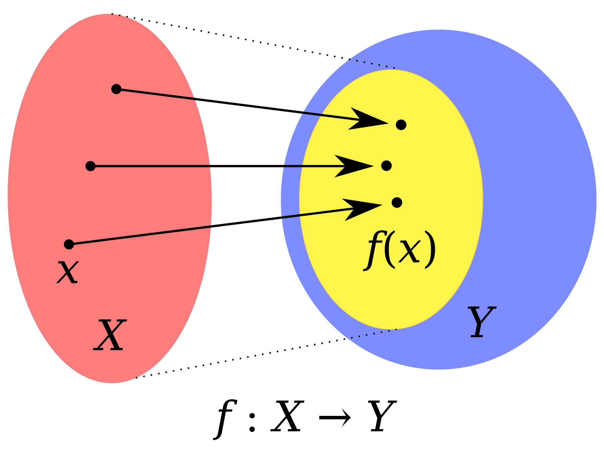

```{r setup}
knitr::opts_chunk$set(echo = TRUE)
suppressPackageStartupMessages({
  library(tidyverse)
  library(grid)
  library(ComplexHeatmap)
  library(gridExtra)
})
```

# Introduction

* The goal is to understand iterative lexical semantic indexing (LSI) which is used as dimensional reduction technique in ArchR. 

* Input:

  + In the common workflow ArchR uses the tile matrix as input. Each tile corresponds to a 500 bp stretch on the genome. The tile matrix has as many rows as tiles and as many columns as cells, so an entry corresponds to the whether a Tn5 insertion was present in the corresponding tile and cell. "Was present" refers to the fact that this matrix is binary as described below!
  
  + However, it is possbile to use any other matrix as input for LSI in ArchR. For example of one has multiome data, one can add the RNA expression matrix to the ArchR project and use it as input for iterative LSI.

* Why does ArchR use iterative LSI instead of PCA?

  + For processing of single-cell RNA-seq data we usually use PCA on the top X variable genes (usually with $x \in [2000, 3000]$)

  + However, in case of the sparse single-cell ATAC data it is inherently difficult to determine highly variable tiles. Therefore we use the top X accessible tiles in the first round with $x \in [25000, 30000]$. So we use many more features and PCA does not scale so well to so many dimensions, because we require centered data, and which is not required for truncated SVD.
  
  + However, the more important reason for using LSI over PCA is that we have binary data with mostly 0s. These zeros do not carry as much information as the 1s, since a 0 could mean either not sampled or not-accessible. But if we were to use PCA, we would assume that cells which have a zero at the same position are similar, in fact these zeros will drive what we call similar, although they do not really carry information. Now LSI allows us to rather focus on the positions with 1s (why?).
  
* What is Lexical Semantic Indexing (LSI)?

  + LSI was developed for natural language processing (NLP). (TODO)

* Iterative LSI Approach: 

  + Iterative means that ArchR performs several rounds of LSI. In the first round the top x accessible tiles, where $x$ is per default $25000$.

  + Since the iterative part is easy to explain, I will focus on explaining LSI below using a mixed terminology between snATAC and NLP.

# Data

To explain LSI we will create a mock tile matrix with 5 rows/tiles and 5 columns/cells. In the terminology of natural language processing the tiles corresponds to the terms with $i = 1, ..., N$ and the cells correspond to the documents with $j = 1, ..., D$. Thus our tile matrix $T$ has dimensions $T \in \mathbb{R}^{N \times D}$ (here: $T \in \mathbb{R}^{5 \times 5}$).

Here we will try to see how we can make a binary mock example.

```{r fig.width=6, fig.height=4}
simple <- tibble::tribble(
  ~cell_A, ~cell_B, ~cell_C, ~cell_D, ~cell_E,
  1, 0, 1, 0, 0,
  0, 1, 0, 1, 0,
  0, 1, 0, 1, 0,
  1, 0, 1, 1, 1,
  1, 0, 1, 0, 1,
  1, 0, 0, 0, 1,
  0, 1, 0, 1, 1
) %>%
  mutate(rownames = paste0("tile_", 1:nrow(.))) %>%
  column_to_rownames(var = "rownames") %>%
  as.matrix()

ComplexHeatmap::pheatmap(
   simple, 
   cluster_rows = F, cluster_cols = F,
   display_numbers = T, 
   fontsize_number = 12, 
   column_names_side = c("top"),
   row_names_side = c("left"),
   angle_col = c("0"),
   circlize::colorRamp2(c(0, max(simple)), c("yellow", "darkorange"), transparency = 0.5),
   column_title = "Tile Matrix",
   heatmap_legend_param = list(title = "Count")
   )
```

```{r}
print(paste0("Rank of the Tile Matrix: ", Matrix::rankMatrix(simple)[1]))
```


We already see that cells A and C are similar on the one hand, whereas cells B and D are similar on the other hand. Cell E is somewhere in between.

# Method

First we will perform some kind of normalization known as TF-IDF of the Tile Matrix.

## Compute TF

The first step is to compute the term frequency (TF) matrix.

Therefore we simply get the fraction 

So assuming we look at term/tile $i$ in document/cell $j$, the corresponding term frequency $tf_{ij}$ would be:

$$
tf_{ij} = \frac{c_{ij}}{\sum_{i'=1}^Nc_{i'j}}
$$

with $c_{ij}$ is the count of term/tile $i$ in document/cell $j$.

```{r}
tf_simple <- t(t(simple) / colSums(simple))
```

```{r fig.width=6, fig.height=4}
ComplexHeatmap::pheatmap(
   tf_simple, 
   cluster_rows = F, cluster_cols = F,
   display_numbers = T, 
   fontsize_number = 12, 
   column_names_side = c("top"),
   row_names_side = c("left"),
   angle_col = c("0"),
   circlize::colorRamp2(c(0, max(tf_simple)), c("yellow", "darkorange"), transparency = 0.5),
   column_title = "Term Frequency Matrix",
   number_format = "%.2f",
   heatmap_legend_param = list(title = "TF")
   )
```

## Compute TF-IDF

Next we will compute the Term Frequency - Inverse Document Frequency (TF-IDF) matrix. The IDF for a term/tile $IDF_i$ is defined as: 

$$
IDF_i = \log \frac{N}{1 + DF_i}
$$

with $DF_i$ being the document count of term/tile $i$, i.e. the number of documents/cells in which the term/tile is present.

So first we compute the document frequencies and then the inverse document frequencies.

```{r}
dfs <- rowSums(tf_simple > 0)
idfs <- ncol(tf_simple)/(dfs+1)
```

```{r fig.width=8, fig.height=3}
p1 <- ComplexHeatmap::pheatmap(
   as.matrix(dfs), 
   cluster_rows = F, cluster_cols = F,
   display_numbers = T, 
   fontsize_number = 12, 
   column_names_side = c("top"),
   row_names_side = c("left"),
   angle_col = c("0"),
   circlize::colorRamp2(c(0, max(dfs)), c("yellow", "darkorange"), transparency = 0.5),
   column_title = "Document Count",
   number_format = "%.2f",
   heatmap_legend_param = list(title = "DF"), 
   run_draw = FALSE
   )

p2 <- ComplexHeatmap::pheatmap(
   as.matrix(idfs), 
   cluster_rows = F, cluster_cols = F,
   display_numbers = T, 
   fontsize_number = 12, 
   column_names_side = c("top"),
   row_names_side = c("left"),
   angle_col = c("0"),
   circlize::colorRamp2(c(0, max(idfs)), c("yellow", "darkorange"), transparency = 0.5),
   column_title = "Inverse Document Frequency",
   number_format = "%.2f",
   heatmap_legend_param = list(title = "IDF"), 
   run_draw = FALSE
   )

ht_list <- p1 + p2
draw(ht_list, ht_gap = unit(1, "cm"), show_heatmap_legend = FALSE)
```

And we basically see that the terms/tile that occur in the fewest documents get the largest weight here. Term/Tile 2 is only present in 2 documents/cells and thus gets the largest value here.

So lastly we need to compute the TF-IDF which is defined for term/tile $i$ in document/cell $j$ as:

$$
TF-IDF_i = \log (TF_{ij} + 1) \times IDF_i
$$

```{r}
tfidf_simple <- log(tf_simple + 1) * idfs
```

```{r fig.width=14, fig.height=4}
p1 <- ComplexHeatmap::pheatmap(
   simple, 
   cluster_rows = F, cluster_cols = F,
   display_numbers = T, 
   fontsize_number = 12, 
   column_names_side = c("top"),
   row_names_side = c("left"),
   angle_col = c("0"),
   circlize::colorRamp2(c(0, 5), c("yellow", "darkorange"), transparency = 0.5),
   column_title = "Input: Tile Matrix",
   heatmap_legend_param = list(title = "Count"), 
   run_draw = FALSE
   )

p2 <- ComplexHeatmap::pheatmap(
   tfidf_simple, 
   cluster_rows = F, cluster_cols = F,
   display_numbers = T, 
   fontsize_number = 12, 
   column_names_side = c("top"),
   row_names_side = c("left"),
   angle_col = c("0"),
   circlize::colorRamp2(c(0, max(tfidf_simple)), c("yellow", "darkorange"), transparency = 0.5),
   column_title = "Output: TF-IDF Matrix",
   number_format = "%.2f",
   heatmap_legend_param = list(title = "TF-IDF"), 
   run_draw = FALSE
   )

ht_list <- p1 + p2
draw(ht_list, ht_gap = unit(2, "cm"))
```

Now we do see the effect of the TF-IDF normalization. For example in cell B, tile 2 had 2 insertions, whereas tile 3 had 3 insertions. Now in the TF-IDF matrix, the value for tile 2 is higher than for tile 3 in cell B, since tile 2 got a high weight.

## Truncated SVD

The foundation of LSI is the truncated SVD of the TF or the TF-IDF matrix. The singular value decomposition exists for any real matrix $A \in \mathbb{R}^{N \times D}$:

$$
A = U \Sigma V^T
$$

with the orthogonal matrix $V \in \mathbb{R}^{D \times D}$ which contains the right singular vectors $v_i$ which form a basis of the domain of $A$, the orthogonal matrix $U \in \mathbb{R}^{N \times N}$ which contains the left singular vectors $v_i$ which form a basis of the codomain of $A$, and the "diagonal matrix" (zero padding) $\Sigma \in \mathbb{R}^{N \times D}$ which contains the singular values $\sigma_i$.

Given the matrix $A$ has rank $r$ we could equivalently write $A$ as a sum of outer products.

$$
A = \sum_{i=1}^r u_i \sigma_i v_i^T
$$

<details>
<summary>Click for Figure describing Domain and Codomain</summary>

A matrix $A$ described a linear mapping $f: X \rightarrow Y$ from the domain $X$ (red) to the codomain $Y$ (blue). The yellow circle visualizes the image/colspace of $A$, i.e. $Im(A) = \{y \in Y | \exists x \in X: f(x)=y\}$ (all "points" in $Y$ that can be reached from $X$ via $A$).

```{r, echo=FALSE, out.width="40%", fig.align='center'}

```

---

</details>

Now we can approximate the matrix $A$ with rank $r$ by a matrix $B$ of rank $k$. It turns out that the rank $k$ matrix which minimizes the error $\| A - B\|$ with some matrix norm (e.g. Spectral norm $\|.\|_2$ or Frobenius norm $\|.\|_F$) is the sum of the outer products of the first $k$ singular vectors and values $A_k$:

$$
A_k = \sum_{i=1}^k u_i \sigma_i v_i^T \\
A_k = \arg \max_B \| A - B\| \quad s.t. \quad rk(B) = k
$$

See for proof the Eckart–Young Theorem.

Let's compute the SVD to visualize the above. First we will look at the SVD components:

```{r}
svd_object <- svd(tfidf_simple, nu=nrow(tfidf_simple), nv=ncol(tfidf_simple))
U <- svd_object$u
Vt <- t(svd_object$v)
S <- rbind(diag(svd_object$d), matrix(0, 
                                      nrow = nrow(tfidf_simple) - length(svd_object$d),
                                      ncol = ncol(tfidf_simple)))
```

```{r fig.width=14, fig.height=4}
p1 <- ComplexHeatmap::pheatmap(
   U, 
   cluster_rows = F, cluster_cols = F,
   display_numbers = T, 
   fontsize_number = 12, 
   column_names_side = c("top"),
   row_names_side = c("left"),
   angle_col = c("0"),
   circlize::colorRamp2(c(min(U), max(U)), c("yellow", "darkorange"), 
                        transparency = 0.5),
   column_title = "U: Left Singular Vectors",
   heatmap_legend_param = list(title = ""), 
   run_draw = FALSE
   )

p2 <- ComplexHeatmap::pheatmap(
   S, 
   cluster_rows = F, cluster_cols = F,
   display_numbers = T, 
   fontsize_number = 12, 
   column_names_side = c("top"),
   row_names_side = c("left"),
   angle_col = c("0"),
   circlize::colorRamp2(c(min(S), max(S)), c("yellow", "darkorange"),
                        transparency = 0.5),
   column_title = "S: Singular Values",
   number_format = "%.2f",
   heatmap_legend_param = list(title = ""), 
   run_draw = FALSE
   )

p3 <- ComplexHeatmap::pheatmap(
   Vt, 
   cluster_rows = F, cluster_cols = F,
   display_numbers = T, 
   fontsize_number = 12, 
   column_names_side = c("top"),
   row_names_side = c("left"),
   angle_col = c("0"),
   circlize::colorRamp2(c(min(Vt), max(Vt)), c("yellow", "darkorange"),
                        transparency = 0.5),
   column_title = "Vt: Right Singular Vectors",
   number_format = "%.2f",
   heatmap_legend_param = list(title = ""), 
   run_draw = FALSE
   )

grid.newpage()
pushViewport(viewport(layout = grid.layout(nr = 1, nc = 3)))
pushViewport(viewport(layout.pos.row = 1, layout.pos.col = 1))
draw(p1, newpage = FALSE)
upViewport()

pushViewport(viewport(layout.pos.row = 1, layout.pos.col = 2))
draw(p2, newpage = FALSE)
upViewport()

pushViewport(viewport(layout.pos.row = 1, layout.pos.col = 3))
draw(p3, newpage = FALSE)
upViewport()
```

Now we will compare the TF-IDF matrix to the full SVD reconstruction (which are the same and both have rank $k = 5$) to the matrix approximation $A_k$ with rank $k=2$. We see that the low-rank approximation is pretty close to the full-rank matrix, meaning there is a lot of redundant information in the matrix.

```{r}
# check whether output makes sense
full_reconstruction = U %*% S %*% Vt
rownames(full_reconstruction) <- rownames(tfidf_simple)
colnames(full_reconstruction) <- colnames(tfidf_simple)

rk <- 2
# check whether output makes sense
rk_approximation = U[,1:rk] %*% S[1:rk, 1:rk] %*% Vt[1:rk,]
rownames(rk_approximation) <- rownames(tfidf_simple)
colnames(rk_approximation) <- colnames(tfidf_simple)
```

```{r fig.width=16, fig.height=4}
p1 <- ComplexHeatmap::pheatmap(
   tfidf_simple, 
   cluster_rows = F, cluster_cols = F,
   display_numbers = T, 
   fontsize_number = 12, 
   column_names_side = c("top"),
   row_names_side = c("left"),
   angle_col = c("0"),
   circlize::colorRamp2(c(min(tfidf_simple), max(tfidf_simple)), 
                        c("yellow", "darkorange"), transparency = 0.5),
   column_title = "TF-IDF Matrix",
   number_format = "%.2f",
   heatmap_legend_param = list(title = "TF-IDF"), 
   run_draw = FALSE
   )

p2 <- ComplexHeatmap::pheatmap(
   full_reconstruction, 
   cluster_rows = F, cluster_cols = F,
   display_numbers = T, 
   fontsize_number = 12, 
   column_names_side = c("top"),
   row_names_side = c("left"),
   angle_col = c("0"),
   circlize::colorRamp2(c(min(full_reconstruction), max(full_reconstruction)), 
                        c("yellow", "darkorange"), transparency = 0.5),
   column_title = "Full Reconstructed TF-IDF Matrix",
   heatmap_legend_param = list(title = "TF-IDF"), 
   run_draw = FALSE
   )

p3 <- ComplexHeatmap::pheatmap(
   rk_approximation, 
   cluster_rows = F, cluster_cols = F,
   display_numbers = T, 
   fontsize_number = 12, 
   column_names_side = c("top"),
   row_names_side = c("left"),
   angle_col = c("0"),
   circlize::colorRamp2(c(min(rk_approximation), max(rk_approximation)), 
                        c("yellow", "darkorange"), transparency = 0.5),
   column_title = "Rank 2 Reconstructed TF-IDF Matrix",
   heatmap_legend_param = list(title = "TF-IDF"), 
   run_draw = FALSE
   )

ht_list <- p1 + p2 + p3
draw(ht_list, ht_gap = unit(2, "cm"), show_heatmap_legend = FALSE)
```

As said above the right singular vectors $v_i$ form a basis for the domain of the TF-IDF matrix. Now instead of using all right singular vectors, we can simply use the first $2$ right singular vectors which form the basis for a 2-dimensional subspace in the domain of the TF-IDF matrix. 

Now this 2-dimensional subspace is our dimensional-reduced feature space and each document/cell $j$ can be described by 2 coordinates.

```{r}
k <- 2
new_basis <- Vt[1:k,]
rownames(new_basis) <- paste0("v", 1:k)
colnames(new_basis) <- colnames(tfidf_simple)
```

```{r fig.width=16, fig.height=4}
p1 <- ComplexHeatmap::pheatmap(
   simple, 
   cluster_rows = F, cluster_cols = F,
   display_numbers = T, 
   fontsize_number = 12, 
   column_names_side = c("top"),
   row_names_side = c("left"),
   angle_col = c("0"),
   circlize::colorRamp2(c(0, 5), c("yellow", "darkorange"), transparency = 0.5),
   column_title = "Input: Tile Matrix",
   heatmap_legend_param = list(title = "Count"), 
   run_draw = FALSE
   )

p2 <- ComplexHeatmap::pheatmap(
   tfidf_simple, 
   cluster_rows = F, cluster_cols = F,
   display_numbers = T, 
   fontsize_number = 12, 
   column_names_side = c("top"),
   row_names_side = c("left"),
   angle_col = c("0"),
   circlize::colorRamp2(c(min(tfidf_simple), max(full_reconstruction)), 
                        c("yellow", "darkorange"), transparency = 0.5),
   column_title = "Intermediate: TF-IDF Matrix",
   heatmap_legend_param = list(title = "TF-IDF"), 
   run_draw = FALSE
   )

p3 <- ComplexHeatmap::pheatmap(
   new_basis, 
   cluster_rows = F, cluster_cols = F,
   display_numbers = T, 
   fontsize_number = 12, 
   column_names_side = c("top"),
   row_names_side = c("left"),
   angle_col = c("0"),
   circlize::colorRamp2(c(min(new_basis), max(new_basis)), 
                        c("yellow", "darkorange"), transparency = 0.5),
   column_title = "Output: Cell Embedding (right singular vectors)",
   heatmap_legend_param = list(title = ""), 
   run_draw = FALSE
   )

grid.newpage()
pushViewport(viewport(layout = grid.layout(nr = 1, nc = 3)))
pushViewport(viewport(layout.pos.row = 1, layout.pos.col = 1))
draw(p1, newpage = FALSE)
upViewport()

pushViewport(viewport(layout.pos.row = 1, layout.pos.col = 2))
draw(p2, newpage = FALSE)
upViewport()

pushViewport(viewport(layout.pos.row = 1, layout.pos.col = 3))
draw(p3, newpage = FALSE)
upViewport()
```

We can easily see that the new lower dimensional space retained the most important information: Cells A and C are still very similar to each other and very different from cells B and D (which are similar to each other).

## Details

 * Now here we compute the full SVD and only used the first 2 singular vectors, but in reality we do not have to compute the full SVD, but we can rather directly approximate the truncated SVD.

# References

